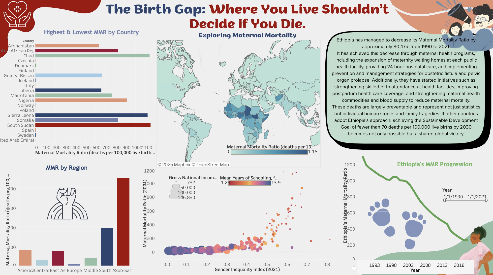

# The Birth Gap — Where You Live Shouldn't Decide if You Die

## Interactive Dashboard
View our Tableau Dashboard here:  
👉 [Click to open on Tableau Public](https://public.tableau.com/app/profile/group.c3.ds.2025.3.1/viz/CAPSTONEPROJECT_17538015048050/Dashboard1)

A woman in Nigeria is 993 times more likely to die in childbirth than a woman in Norway. To understand a problem like that, our project explores how geography, gender inequality, and access to education and healthcare determine whether a woman survives childbirth, and why these deaths are preventable.

As a group of four, we explored several datasets, formed data visualizations that illustrated the statistics, and organized everything to make sure it clearly conveys the main idea of our project.

## Group Member's LinkedIn
My fellow teammates include: [Mariam](https://www.linkedin.com/in/mariam-boghdadi-919520236/), [Alayna](https://www.linkedin.com/in/alayna-hassan-063052230/), [Renad](https://www.linkedin.com/in/renad-waleed-584131352/)

## Dashboard Preview

